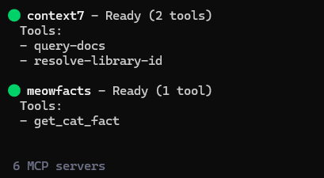
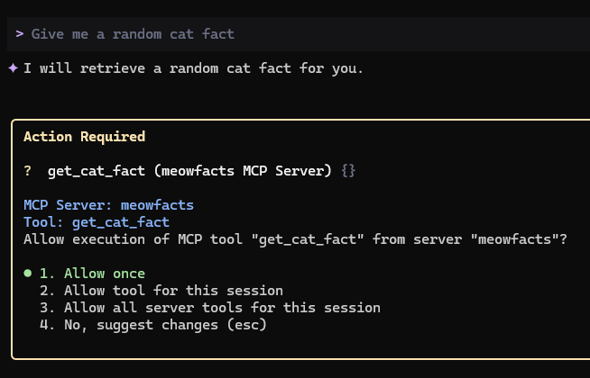
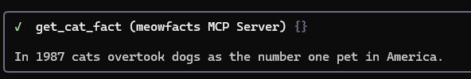

# meowfacts-mcp
### MCP Server for returning random cat facts

This repository is designed to be a tutorial for building very simple MCP (Model Context Protocol) servers. It allows us to study the underlying components of MCP servers, like the python scripts that handle abstraction of APIs for MCP clients.  In this tutorial we'll be using a public API called [meowfacts](https://github.com/wh-iterabb-it/meowfacts) by [wh-iterabb-it](https://github.com/wh-iterabb-it/), which returns a random cat fact as a response to requests.

### Introduction

MCP servers allow Large Language Models (LLMs) to interact with external data sources and APIs.  The MCP protocol facilitates this interaction using a client/server model which abstracts a significant amount of the effort that would typically be involved in running API commands, parsing results, and maintaining scripts.

A good place to start with implementing a new MCP server is by studying the example on [modelcontextprotocol.io](https://modelcontextprotocol.io/docs/develop/build-server#weather-api-issues).  This example uses the National Weather Service (NWS) API to create an MCP server that exposes two tools:  A tool for getting weather advisories given a state, and a tool for getting weather forecasts given a latitude and longitude coordinate pair.

The theory behind the example allows us to extend this functionality to other APIs.  meowfacts-mcp uses the code in the example as a starting point to develop a new MCP server which exposes a tool which allows the LLM to return a random cat fact.

### Our Target API
By studying the meowfacts API in the original project, we can see that the API consists of one endpoint: `https://meowfacts.herokuapp.com/`

This API endpoint accepts `GET` requests, and while it supports a few more advanced parameters (like language support and support for finding facts by ID), we'll keep the initial version of our MCP server simple by only implementing the API call that returns a single random fact, which in our case is going to be a `GET` request to `https://meowfacts.herokuapp.com/`

### Server Setup

You can build this MCP server from scratch by following the below steps. 

`uv` will handle the generation of the environment, and we'll create a file called meowfacts.py to hold the server.
```
# Create a new directory for the meowfacts server
mkdir meowfacts-server
cd meowfacts-server

# Activate the python virtual environment
uv init
uv add "mcp[cli]" httpx

# Create the meowfacts.py file.
New-Item meowfacts.py
```

You can populate the empty meowfacts.py file with the content of meowfacts.py in this repository.

### Client Setup
Like other MCP servers, leveraging the meowfacts MCP server involves specifying the server in our settings file.   In a MCP client like Gemini CLI, this is done by modifying `settings.json` in the Gemini working directory in order to define the new server, so let's do that.

Let's assume we created the server in the directory C:\Users\sysop\meowfacts-server.  Our `settings.json` for this setup would look similar to the following.  If you have other MCP servers defined, you would just introduce the meowfacts object into the existing mcpServers object alongside the existing MCP servers.  In the following example, only one MCP server is defined: meowfacts.

```
{
  "security": {
    "auth": {
      "selectedType": "oauth-personal"
    }
  },
  "ui": {
    "showHomeDirectoryWarning": false
  },
  "general": {
    "previewFeatures": true
  },
  "mcpServers": {
    "meowfacts": {
      "command": "uv",
      "args": [
        "--directory",
        "C:\\Users\\sysop\\meowfacts-server",
        "run",
        "meowfacts.py"
      ]
    }
  }
}
```

### Testing
With both the MCP Server and MCP Client set up, our architecture is complete and we can proceed to testing!  

After saving `settings.json` and starting Gemini CLI, we can verify that the meowfacts MCP server is running by typing `/mcp list`



We can now proceed to ask Gemini CLI to give us a random cat fact!  Enter the following prompt: `Give me a random cat fact`

Gemini CLI will locate the correct tool to use based on the prompt, which in our case is the `get_cat_fact` tool in our new meowfacts MCP server.  

Gemini CLI will ask us to confirm we want to run this tool.  Select `Allow Once` so we can run the tool and see what random cat fact we get!



#### The result



Gemini CLI displays our random cat fact: 
`In 1987 cats overtook dogs as the number one pet in America.`  

Who knew!
```
       |\      _,,,---,,_
 ZZzzz /,`.-'`'    -.  ;-;;,_
      |,*-  ) )-,_. ,\ (  `'-'
     `'---''(_/--'  `-'\_)
```
